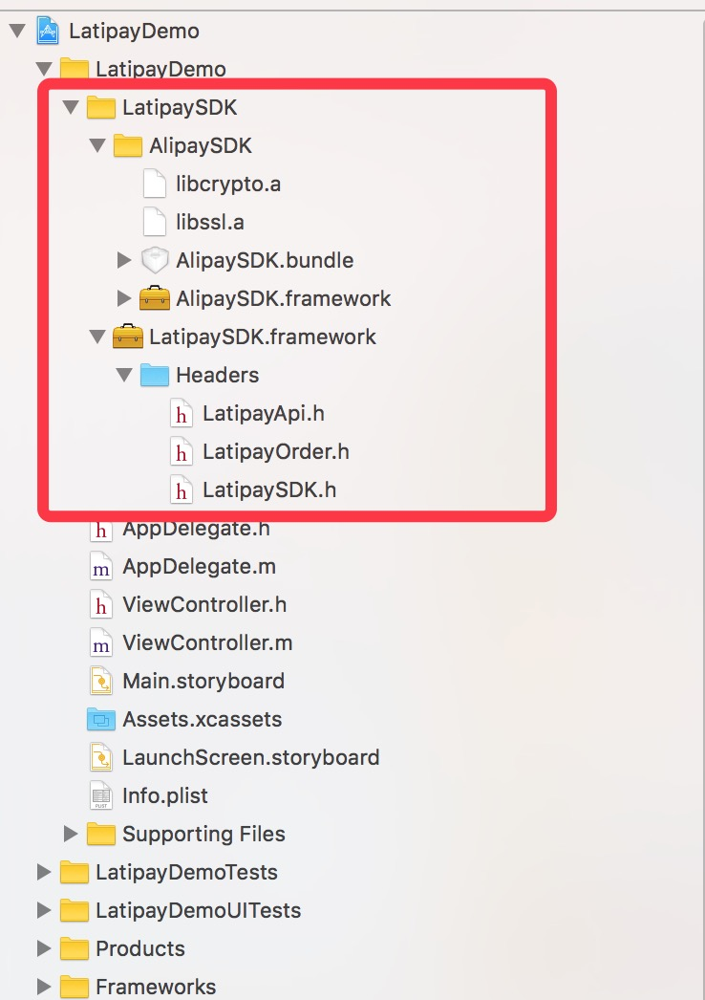
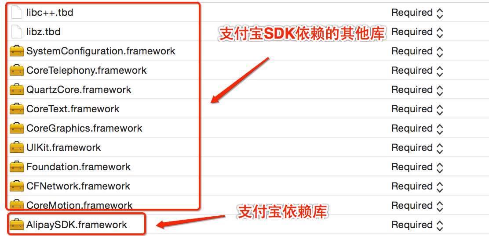
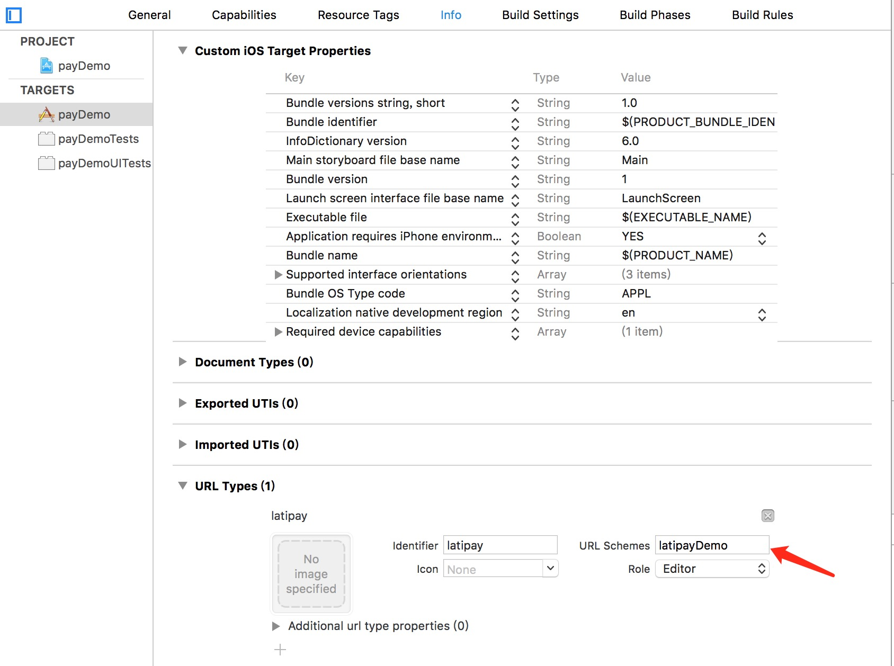
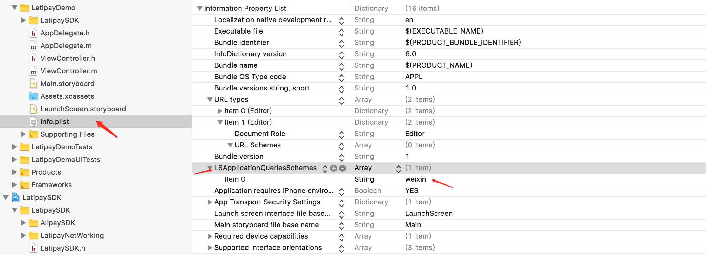

# Latipay支付服务
## 主要功能
1. 通过LatipaySDK唤起微信支付和支付宝支付.

## 使用方法
1 将整个文件夹拖到你的项目中,包括AlipaySDK和LatipaySDK.(注意用group形式,目录会显示成黄色).

   

2 添加AlipaySDK所依赖的动态库

   

3 在AppDelegate.m文件顶部引入头文件Latipay.h,并且写入下面的配置信息
``` objectivec
//AppDelegate.m

- (BOOL)application:(UIApplication *)application didFinishLaunchingWithOptions:(NSDictionary *)launchOptions {
    //配置开发环境，如果不设置默认为LatipayDebug模式，上线请改成LatipayRelease模式
    [[LatipayApi shareInstance]setEnvironment:LatipayDebug];
    return YES;
}

```

4 支付接口使用说明:
``` objectivec

/**
Latipay request

@param order 订单信息，详见LatipayOrder参数说明
@param schemeStr 设置url schemes，以供支付宝返回到app
@param completionBlock 支付结果回调
   error code 说明
   300:订单类型需为LatipayOrder类型，或其子类;
   301:参数有误，请检查核对输入正确参数;
   302:Latipay服务器error;
*/
- (void)payOrder:(LatipayOrder *)order fromScheme:(NSString *)schemeStr callback:(CompletionResultBlock)completionBlock;


//支付实例：
- (IBAction)pay:(id)sender {
    LatipayOrder *order = [LatipayOrder new];
    order.amount = @"0.04";
    order.callback_url = @"https://spotpay-staging.latipay.net/confirmation";
    order.ip = @"112.224.65.231";
    order.merchant_reference = @"W000000186";
    order.payment_method = @"alipay";
    order.product_name = @"W000000186";
    order.return_url = @"https://spotpay-staging.latipay.net/confirmation";
    order.signature = @"9d6e767e44f4ddc399e15c793d7225793f067dfe680c12cf1f3cfac4711681af";
    order.user_id = @"U000000178";
    order.wallet_id = @"W000000186";
    order.source = @"ios";

    [[LatipayApi shareInstance] payOrder:order fromScheme:@"latipayDemo" callback:^(NSDictionary *resultDic, NSError *error) {

    }];
}
```
设置url schemes  以便支付宝返回app

设置app白名单 以便调起weixin客户端


5 设置支付宝支付结果回调 

``` objective
/**
 支付宝回调api
 @param resultUrl 用于接收支付宝回调的url
 @param completionBlock 支付宝回调结果
   error code 说明
   9000:支付宝-订单支付成功;
   8000:支付宝-正在处理中，支付结果未知（有可能已经支付成功），请查询商户订单列表中订单的支付状态";
   4000:支付宝-订单支付失败;
   5000:支付宝-重复请求;
   6001:支付宝-用户中途取消;
   6002:支付宝-网络连接出错;
   6004:支付宝-支付结果未知（有可能已经支付成功），请查询商户订单列表中订单的支付状态;
   6005:支付宝-其它支付错误;
 */
 
//支付宝回调方法。
- (void)processOrderWithLatipayResult:(NSURL *)resultUrl standbyCallback:(CompletionResultBlock)completionBlock;

//支付宝回调方法的调用举例
// NOTE: 9.0之前
- (BOOL)application:(UIApplication *)application openURL:(NSURL *)url sourceApplication:(NSString *)sourceApplication annotation:(id)annotation {
    // 支付跳转支付宝钱包进行支付，处理支付结果
    [[LatipayApi shareInstance]processOrderWithLatipayResult:url standbyCallback:^(NSDictionary *resultDic, NSError *error) {

    }];
    return YES;
}

// NOTE: 9.0以后使用新API接口
- (BOOL)application:(UIApplication *)app openURL:(NSURL *)url options:(NSDictionary<NSString*, id> *)options
{
    //支付跳转支付宝钱包进行支付，处理支付结果
    [[LatipayApi shareInstance]processOrderWithLatipayResult:url standbyCallback:^(NSDictionary *resultDic, NSError *error) {

    }];
    return YES;
}

```
6 微信支付说明
  由于微信支付完成后只能返回商家自定义H5页面，所以相关回调请在H5页面内完成。
